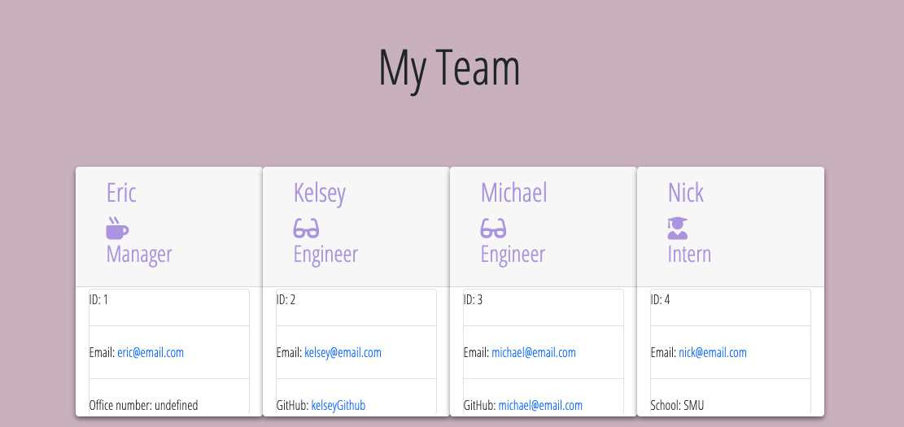

# 10 Template Engine

 In this homework assignment, I built a Node CLI that takes in information about employees and generates an HTML webpage that displays summaries for each person. Since testing is a key piece in making code maintainable, you will also be ensuring that all unit tests pass.You will build a software engineering team generator command line application. The application will prompt the user for information about the team manager and then information about the team members. The user can input any number of team members, and they may be a mix of engineers and interns. This assignment must also pass all unit tests. When the user has completed building the team, the application will create an HTML file that displays a nicely formatted team roster based on the information provided by the user. 


## Complete 

* Use the `Inquirer npm package` to prompt the user for their email, id, and specific information based on their role with the company. For instance, an intern may provide their school, whereas an engineer may provide their GitHub username.

* Built the necessary html templates for each type of user:

  - `main.html`

  - `engineer.html`
  
  -  `intern.html`
  
  - `manager.html`

* Follow this workflow:
1. Run tests
2. Create or update classes to pass a single test case
3. Repeat

* The project must generate a `team.html` page in the `output` directory, that displays a nicely formatted team roster. Each team member should display the following in no particular order:

  * Name

  * Role

  * ID

  * Role-specific property (School, link to GitHub profile, or office number)

```
As a manager
I want to generate a webpage that displays my team's basic info
so that I have quick access to emails and GitHub profiles
```
## Deployed Link
[Deployed Link](https://cynthia-dm1216.github.io/10-template-engine/.)

## Screenshots



## GIF


- - -
© 2019 Trilogy Education Services, a 2U, Inc. brand. All Rights Reserved.
